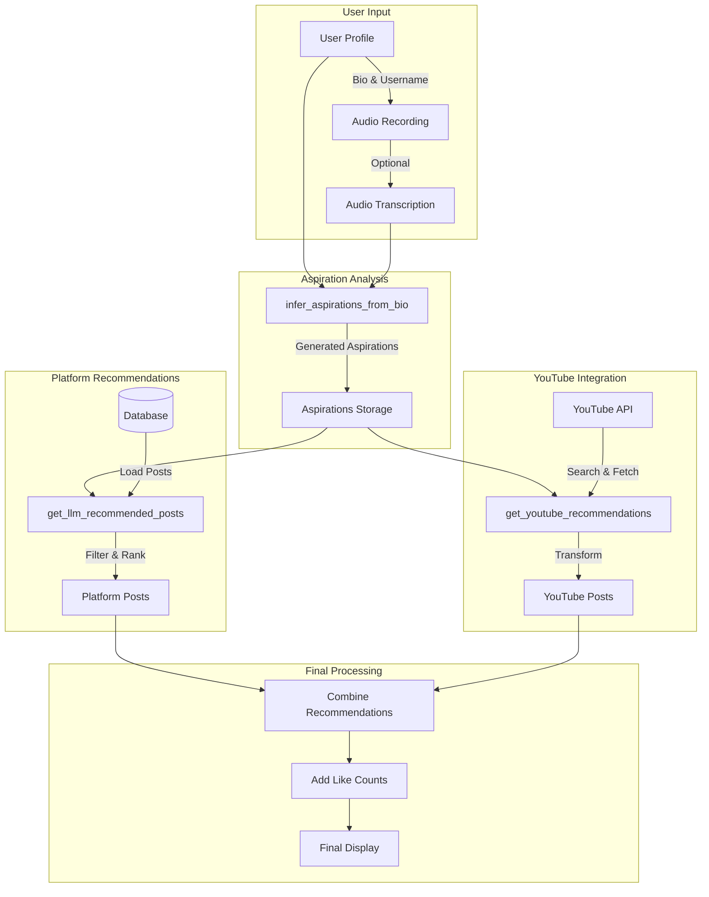

```mermaid
flowchart TD
    subgraph User Input
        A[User Profile] --> |Bio & Username| B[Audio Recording]
        B --> |Optional| C[Audio Transcription]
    end

    subgraph Aspiration Analysis
        A & C --> D[infer_aspirations_from_bio]
        D --> |Generated Aspirations| E[Aspirations Storage]
    end

    subgraph Platform Recommendations
        E --> F[get_llm_recommended_posts]
        G[(Database)] --> |Load Posts| F
        F --> |Filter & Rank| H[Platform Posts]
    end

    subgraph YouTube Integration
        E --> I[get_youtube_recommendations]
        J[YouTube API] --> |Search & Fetch| I
        I --> |Transform| K[YouTube Posts]
    end

    subgraph Final Processing
        H & K --> L[Combine Recommendations]
        L --> M[Add Like Counts]
        M --> N[Final Display]
    end

    class D,F,I,L,M processNode
    class G storageNode
    class J apiNode

```