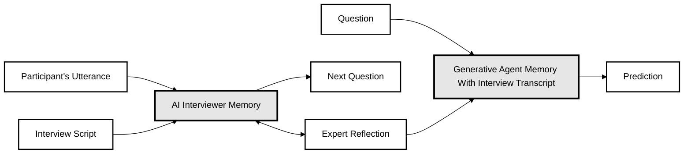

# Combined AI Interview and Generative Agent Flow

This diagram illustrates the interconnected flow between an AI Interviewer system and a Generative Agent, with enhanced contrast for better readability.

## Components

### AI Interviewer Flow
- **Participant's Utterance**: Input from the interview participant
- **Interview Script**: Predefined interview structure and questions
- **AI Interviewer Memory**: System memory storing interview context and responses
- **Next Question**: Generated follow-up question based on the conversation

### Shared Component
- **Expert Reflection**: Reflection mechanism that bridges both systems

### Generative Agent Flow
- **Question**: Input query to the generative system
- **Generative Agent Memory**: System memory incorporating interview transcript
- **Prediction**: Generated output based on memory and reflection